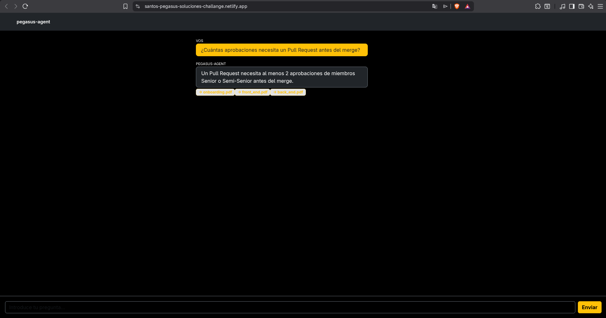

# Pegaus Agent

Agente de inteligencia artificial (RAG) que responde preguntas sobre los documentos internos de **Santo Pegasus Soluciones** en lenguaje natural, sin necesidad de abrir manuales ni PDFs.
 
Proyecto desarrollado como challenge del programa ONE AI de Alura LATAM

## Índice

- [Arquitectura](#arquitectura)
  - [Flujo del pipeline RAG](#flujo-del-pipeline-rag)
- [Ejemplos de preguntas y respuestas](#ejemplos-de-preguntas-y-respuestas)
- [Cómo ejecutar el proyecto localmente](#cómo-ejecutar-el-proyecto-localmente)
- [Deploy](#-deploy)
- [Estructura del proyecto](#estructura-del-proyecto)
- [Notas](#notas)

---

## Arquitectura
 
El proyecto está dividido en dos partes independientes que se comunican por HTTP:
 
```
┌─────────────────┐         HTTP POST /ask        ┌──────────────────────┐
│                  │  ───────────────────────────> │                      │
│  Frontend        │                                │  Backend             │
│  React + Vite    │         JSON response          │  FastAPI + LangChain │
│  (Bootstrap)     │  <─────────────────────────── │                      │
└─────────────────┘                                └──────────┬───────────┘
                                                                │
                                                                ▼
                                                     ┌──────────────────────┐
                                                     │  FAISS Vector Store  │
                                                     │  (índice local)      │
                                                     └──────────┬───────────┘
                                                                │
                                                                ▼
                                                     ┌──────────────────────┐
                                                     │  Groq API             │
                                                     │  (llama-3.3-70b)      │
                                                     └──────────────────────┘
```

 ### Flujo del pipeline RAG
 
1. **Ingesta** (`ingest.py`, se corre una sola vez): los 5 documentos PDF internos de la empresa se cargan con `PyPDFLoader`, se trocean en fragmentos de ~1000 caracteres con `RecursiveCharacterTextSplitter`, se convierten en embeddings con el modelo `sentence-transformers/all-MiniLM-L6-v2` (corre 100% local, sin costo) y se guardan en un índice vectorial **FAISS**.
2. **Consulta** (`api.py`, corre como servidor): al recibir una pregunta, el retriever busca los fragmentos más relevantes en el índice FAISS, se los pasa como contexto al LLM (**Groq / Llama 3.3 70B**) junto con un prompt que restringe la respuesta al contenido de los documentos, y devuelve la respuesta junto con las fuentes citadas.
3. **Interfaz** (React): el usuario escribe su pregunta en un chat estilo consola de desarrollo, la manda al backend y muestra la respuesta junto con badges indicando de qué documento(s) salió la información.

## Ejemplos de preguntas y respuestas
 
**Pregunta:** ¿Cuántas aprobaciones necesita un Pull Request antes del merge?
**Respuesta:** Según la información proporcionada, un Pull Request necesita al menos 2 aprobaciones para ser considerado aprobado. Cualquier intento de push directo será rechazado por GitHub.
**Fuente:** `guia_backend.pdf`
 
**Pregunta:** ¿Qué es un post-mortem y cuándo se realiza?
**Fuente esperada:** `incidentes.pdf`
 
**Pregunta:** ¿Qué stack tecnológico usa el equipo de frontend?
**Fuente esperada:** `guia_frontend.pdf`
 
**Pregunta:** ¿Cuál es la estructura de dominios en la arquitectura de microservicios?
**Fuente esperada:** `arquitectura.pdf`
 
**Pregunta:** ¿Qué debe hacer un nuevo desarrollador en su primera semana?
**Fuente esperada:** `onboarding.pdf`
 
---

## Cómo ejecutar el proyecto localmente
 
### Requisitos previos
- Python 3.10+
- Node.js + [pnpm](https://pnpm.io/)
- Una API key gratuita de [Groq](https://console.groq.com/)
### 1. Clonar el repositorio
```bash
git clone https://github.com/Elias-J-Guardado/pegasus-agent.git
cd pegasus-agent
```
 
### 2. Backend
```bash
cd backend
python3 -m venv venv
source venv/bin/activate        # En Windows: venv\Scripts\activate
 
pip install torch --index-url https://download.pytorch.org/whl/cpu
pip install -r requirements.txt
```
 
Creá un archivo `.env` dentro de `backend/` con tu API key:
```
GROQ_API_KEY=tu_key_aqui
```
 
Generá el índice vectorial (solo la primera vez, o si cambiás los documentos):
```bash
python ingest.py
```
 
Levantá el servidor:
```bash
uvicorn api:app --reload --port 8000
```
 
Verificá que esté vivo:
```bash
curl http://localhost:8000/health
```
 
### 3. Frontend
En otra terminal:
```bash
cd frontend
pnpm install
```
 
Creá un archivo `.env` dentro de `frontend/`:
```
VITE_API_URL=http://localhost:8000
```
 
Levantá la app:
```bash
pnpm dev
```
 
Abrí la URL que te muestre la terminal (normalmente `http://localhost:5173`).
 
---

## Deploy
 
- **Backend:** *(https://alura-challange-santos-pegasus-soluciones.onrender.com)*
- **Frontend:** *(https://santos-pegasus-soluciones-challange.netlify.app/)*

**Captura de proyecto en producción**


 
---

## Estructura del proyecto
 
```
pegasus-agent/
├── backend/
│   ├── docs/                # PDFs internos de la empresa
│   ├── ingest.py             # Construye el índice FAISS
│   ├── api.py                 # Servidor FastAPI con el agente RAG
│   ├── requirements.txt
│   └── .env                   # GROQ_API_KEY (no versionado)
├── frontend/
│   ├── src/
│   │   ├── components/
│   │   │   ├── Mensaje.jsx
│   │   │   ├── Cargando.jsx
│   │   │   └── EntradaTexto.jsx
│   │   └── App.jsx
│   └── .env                   # VITE_API_URL (no versionado)
├── .gitignore
└── README.md
```

## Notas
 
- Los embeddings se generan localmente (sin costo ni API key), solo la generación de respuestas usa la API de Groq.
- El backend es *stateless*: no guarda historial de conversación entre peticiones; el historial visual del chat vive únicamente en el estado del frontend.
- Documentos fuente: manual de onboarding, guías de ingeniería back-end y front-end, protocolo de incidentes, y arquitectura de microservicios de Santo Pegasus Soluciones (empresa ficticia usada como caso de estudio).
 